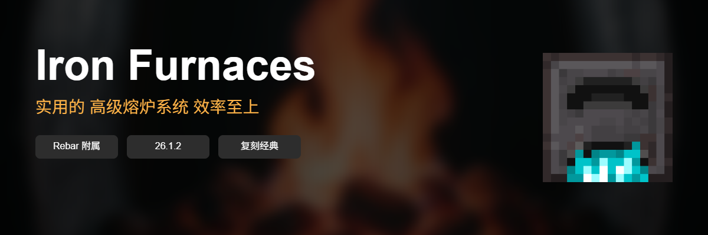

<p align="center">
  
</p>

<p align="center">
  <h1>🔥 Iron Furnaces</h1>
  <strong>高级熔炉系统 - 9种等级 · 升级组件 · 美观GUI</strong>
</p>

<p align="center">
  
  
</p>

---

## 📋 简介

**Iron Furnaces** 是 **Rebar 框架的附属插件**，复刻经典模组 **[Iron Furnaces](https://modrinth.com/mod/iron-furnaces)**。

本插件为你的服务器添加**多级高级熔炉**，从铜到下界合金，9种不同速度的熔炉满足你所有需求！

### ⚠️ 前置要求

| 要求 | 版本 | 说明 |
|------|------|------|
| **Minecraft** | **26.1.2** | 仅支持此版本（Paper 或其分支）|
| **Rebar** | **0.40.0+** | 必须安装，本插件是 Rebar 的附属插件 |

> ⚠️ **重要：** 本插件**必须配合 Rebar 使用**，无法独立运行！请先安装 [Rebar](https://github.com/pylonmc/Rebar) 插件。

### ✨ 核心特性

- 🔥 **9种熔炉等级** - 最快可达原版 **200倍** 速度
- ⬆️ **6种升级组件** - 自定义熔炉能力（加速、省燃料、自动化等）
- 🎨 **精美界面** - 基于 InvUI 的简洁操作界面
- 📊 **智能进度条** - 打火石进度条随烧炼**耐久度增加**
- ⛽ **燃料可视化** - 实时显示燃料类型和剩余时间
- 🌈 **特殊熔炉** - 彩虹熔炉（颜色变化+批量处理）、水晶熔炉（半透明）
- 🌐 **中文支持** - 完整的简体中文界面
- ⚖️ **平衡机制** - 升级组件有负面效果，需要策略搭配

---

## 🚀 快速开始

### 安装步骤（30秒）

1. **安装 Rebar** - 确保 `plugins` 文件夹已有 Rebar 插件
2. **下载本插件** - 获取 `Iron-Furnaces-1.1.0.jar`
3. **放入服务器** - 将 jar 文件放入 `plugins` 文件夹
4. **重启服务器** - 输入 `/reload` 或重启服务器

完成！🎉

### 获取熔炉

```minecraft
/rb give @p ironfurnaces:iron_furnace      # 铁熔炉
/rb give @p ironfurnaces:diamond_furnace   # 钻石熔炉
/rb give @p ironfurnaces:netherite_furnace # 下界合金熔炉
/rb give @p ironfurnaces:rainbow_furnace   # 彩虹熔炉
# ... 更多见下方"熔炉等级"
```

---

## 🎮 使用方法

1. **放置熔炉** - 像普通方块一样放置
2. **右键打开** - 点击熔炉打开操作界面
3. **放入燃料** - 底部槽位放燃料（煤炭、木炭等）
4. **放入物品** - 左侧槽位放要烧炼的东西
5. **取出成品** - 右侧槽位自动输出结果
6. **点击⚒️按钮** - 打开升级界面（可选）

就这么简单！

---

## 🔥 熔炉等级

复刻原版 Iron Furnaces MOD 的经典等级体系：

| 等级 | 材质 | 速度 | 说明 |
|------|------|------|------|
| 🟤 **铜熔炉** | Copper Block | 180t/item | 入门级，适合初期 |
| ⬜ **铁熔炉** | Iron Block | 160t/item | 进阶选择 |
| 🟨 **金熔炉** | Gold Block | 120t/item | 性价比之选 |
| 💎 **钻石熔炉** | Diamond Block | 80t/item | 推荐日常使用 |
| 💚 **绿宝石熔炉** | Emerald Block | 40t/item | 大规模生产 |
| 💠 **水晶熔炉** | Stained Glass | 40t/item | 半透明外观 |
| ⬛ **黑曜石熔炉** | Obsidian | 20t/item | 工业级效率 |
| 🟫 **下界合金熔炉** | Netherite Block | 5t/item | 极速熔炼（36倍！）|
| 🌈 **彩虹熔炉** | Wool (动态) | 20t/item | 特殊效果 + 批量处理 |

---

## ⬆️ 升级系统

熔炉支持 **6种升级组件**，每种都有独特效果和**负面平衡机制**：

### 升级列表

| 升级 | 效果 | 负面效果 | 槽位 |
|------|------|---------|------|
| ⚡ **速度升级** | 烧炼速度 ×4 | 燃料消耗 +50% | 🔴 红色槽 |
| ⛽ **燃料升级** | 燃料效率 ×2 | 烧炼时间 +25% | 🟢 绿色槽 |
| 🏭 **高炉升级** | 可烧制矿石/矿物 | 燃料消耗 ×2 | 🔴 红色槽 |
| 🚬 **烟熏炉升级** | 可烹饪食物 | 燃料消耗 ×2 | 🔴 红色槽 |

### 使用规则

- ✅ **同类型只能放1个** - 防止重复叠加
- ✅ **分类槽位放置** - 特殊烧制放红色，效率放绿色，自动化放蓝色
- ✅ **智能验证** - 放错位置会自动取消
- ⚖️ **平衡设计** - 强力升级有代价，需要策略搭配

### 推荐组合

| 场景 | 推荐配置 | 说明 |
|------|---------|------|
| 日常使用 | 速度+燃料 | 平衡速度与燃料消耗 |
| 批量矿石 | 高炉+速度 | 快速冶炼矿石 |
| 大量烹饪 | 烟熏炉+燃料 | 省燃料批量做食物 |
| 全自动 | 输出+输入+速度 | 完全自动化生产线 |

---

## 🌈 特殊熔炉

### 彩虹熔炉 🌈

致敬原版 MOD 的终极熔炉，拥有独特能力：

- ✨ **颜色循环** - 每10tick自动变换16种羊毛颜色
- 🎆 **彩色粒子** - 烧炼时释放彩色烟雾粒子特效
- 📦 **批量处理** - 燃料充足时可一次烧炼多个物品

**适合场景：** 高效批量生产

### 水晶熔炉 💠

- 🔮 **半透明外观** - 使用玻璃材质，光线可穿透
- 📐 **边框装饰** - 自动生成12条玻璃边框线条
- 💎 **独特视觉效果** - 区别于普通熔炉的视觉体验

---

## 🛠️ 命令与权限

| 命令 | 说明 | 权限节点 |
|------|------|---------|
| `/rb give @s ironfurnaces:xxx_furnace` | 获取指定熔炉 | `ironfurnaces.give.*` |
| `/ironfurnaces reload` | 重载插件配置 | `ironfurnaces.admin` |

*详细权限配置请查看插件生成的 `config.yml`*

---

## 📞 支持与反馈

- **问题报告**: [GitHub Issues](../../issues)
- **功能建议**: [GitHub Discussions](../../discussions)
- **原版 MOD**: [Iron Furnaces (Modrinth)](https://modrinth.com/mod/iron-furnaces)

---

## 📝 更新日志

### v1.1.0 - 平衡与优化 🎯

#### ✨ 新功能
- ⬆️ **完整升级系统** - 6种升级组件全部可用，带负面平衡机制
- 📊 **智能进度条** - 打火石进度条随烧炼耐久度增加（更直观）
- ⛽ **燃料可视化** - 实时显示燃料类型和剩余时间
- 🔒 **槽位限制** - 同类型升级只能放1个，分类放置到正确槽位

#### 🐛 修复
- ✅ 修复打火石进度条方向错误（现正确增加）
- ✅ 修复无配方时仍消耗燃料的问题
- ✅ 修复燃料格闪烁烈焰粉图标的问题
- ✅ 修复高炉/烟熏炉燃料消耗未加倍的问题
- ✅ 修复 GUI 标题显示不正确的问题

#### ⚖️ 平衡调整
- 速度升级：烧炼速度 ×4，但**燃料消耗 +50%**
- 燃料升级：燃料效率 ×2，但**烧炼时间 +25%**
- 高炉/烟熏升级：燃料消耗 **×2**
- 已点燃的燃料会**完全燃烧**，不会停止

### v1.0.0 - 初始版本 🎉

- 🔥 9种熔炉等级（铜 → 下界合金）
- 🌈 彩虹熔炉和水晶熔炉
- 🎨 基础 GUI 界面
- 🌐 中文支持

---

<div align="center">

**享受更快的熔炼体验！** 🔥

<p>
 Made with ❤️ for <strong>Minecraft 26.1.2</strong> · Powered by <strong>mc506lw</strong>
</p>

<p>
<em>复刻经典 · 致敬 Iron Furnaces MOD</em>
</p>

</div>
